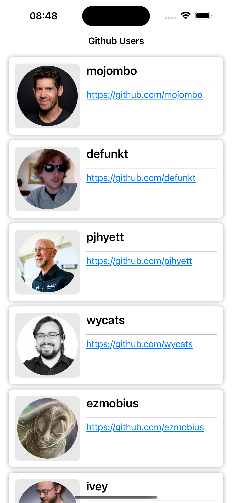
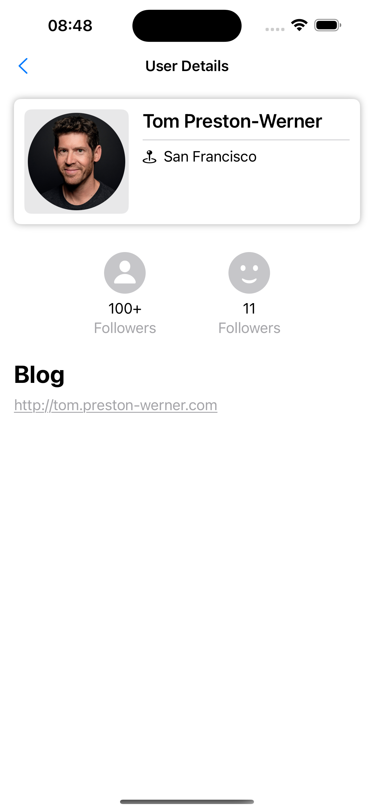
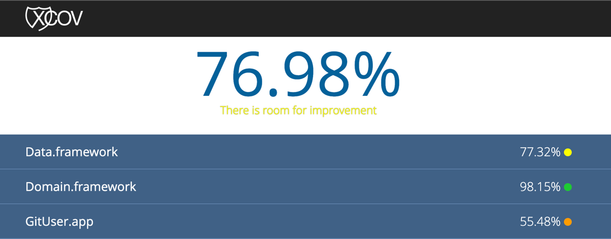

# GitUser

## Screenshots
| User List | User Detail|
|-|-|
|  |  |

## Code Coverage Report

## Build: 

- **Version**: 1.0
- **Installable Artifact
  **: [Download Here](https://app.bitrise.io/app/d770b010-39d9-44af-a15a-4f6257c39878/installable-artifacts/60eb69a290b0b8ce/public-install-page/65a26f33ce2d5a7ddac8c603e4135460)

## Project Template

This project is based on the [Nimble iOS Templates](https://github.com/nimblehq/ios-templates), which provide a robust and scalable foundation for iOS app development. Reference

## Requirements

- Ruby `3.1.2`
- Xcode `15+`

## Install Dependencies

- `bundle install`
- `bundle exec pod install`

Build with Xcode.
